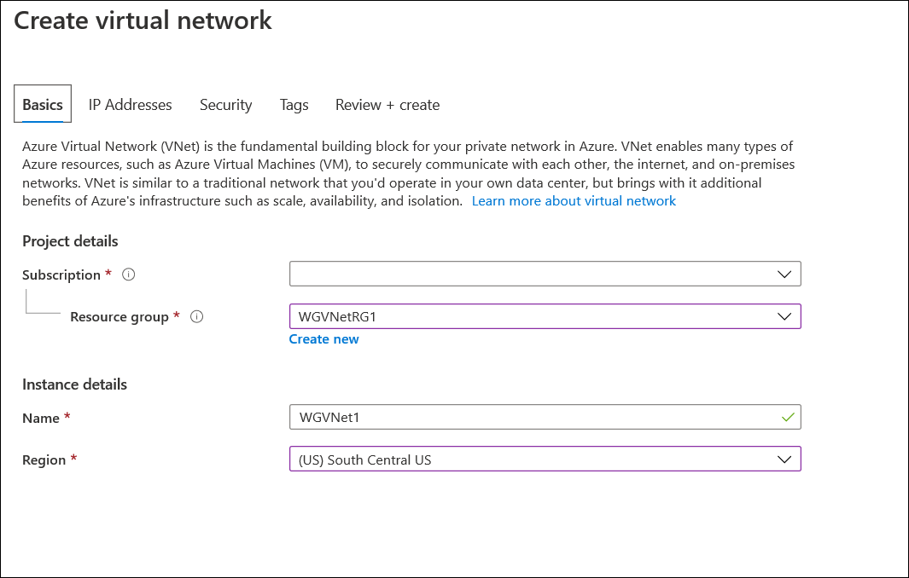
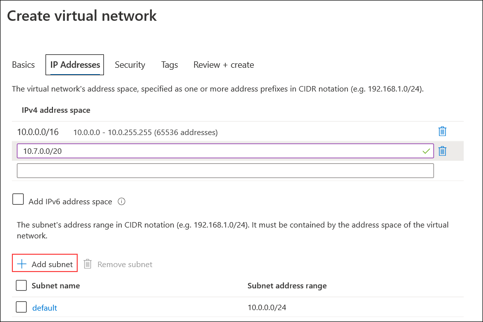
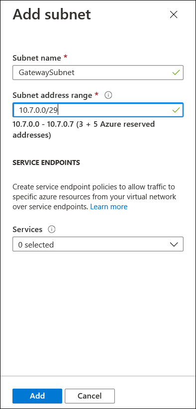
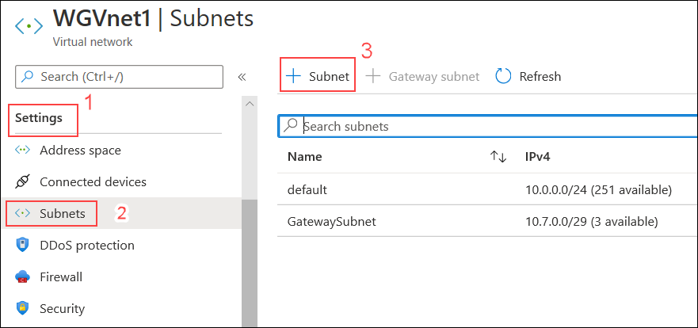
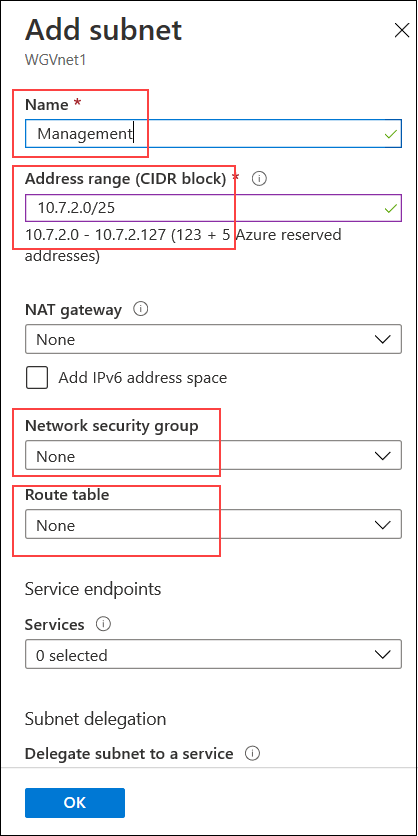

## Exercise 1: Create a Virtual Network and provision subnets

Duration: 15 minutes

### Task 1: Create a Virtual Network

1.  From your **LABVM**, connect to the Azure portal, select **+ Create a resource**, and in the list of Marketplace categories, select **Networking** followed by selecting **Virtual Network**.

2.  On the **Create virtual network** blade under Basics, enter the following information:

    -  Name: **WGVNet1**

    -  Subscription: **Select your subscription**.

    -  Resource group: Select **WGVNetRG1** from the drop down list of Resource Group.

    -  Location: **(US) South Central US**
    
     
    
3. Under IP Addresses, enter the following information:

    -  Address space: **10.7.0.0/20**
    
    
    
    And Click on **+ Add Subnet** to add subnets to the virtual network
    
    Then provide the values for:
    
    -  Subnet name: **GatewaySubnet** (This name is fixed and cannot be changed.)
    
    -  Subnet address range: **10.7.0.0/29**
    
    
    
4.  Leave the other options as default for now.

5.  Upon completion, it should look like the following screenshot. Validate the information is correct, and select **Create**.

6.  Monitor the deployment status by selecting **Notifications Bell** at the top of the portal. In a minute or so, you should see a confirmation of the successful deployment. Select **Go to Resource**.

### Task 2: Configure subnets

1.  Go to the WGVNetRG1 Group, and select **WGVNet1 Virtual Network** blade if you're not there already, and select **Subnets** under **Settings** on the left.

2.  In the **Subnets** blade select **+Subnet**.

    

3.  On the **Add subnet** blade, enter the following information:

    -  Name: **Management**

    -  Address range: **10.7.2.0/25**

    -  Network security group: **None**

    -  Route table: **None**

    -  Service Endpoints: **Leave as Default**.

4.  When your dialog looks like the following screenshot, select **OK** to create the subnet.

    

5. Repeat Step 3, enter the following information for the Azure Firewall which we will use to control traffic flow in and out of the Network. 

    -  Name: **AzureFirewallSubnet** (This name is fixed and cannot be changed.)

    -  Address range: **10.7.1.0/24**

    -  Network security group: **None**

    -  Route table: **None**

    -  Service Endpoints: **Leave as Default**

    
