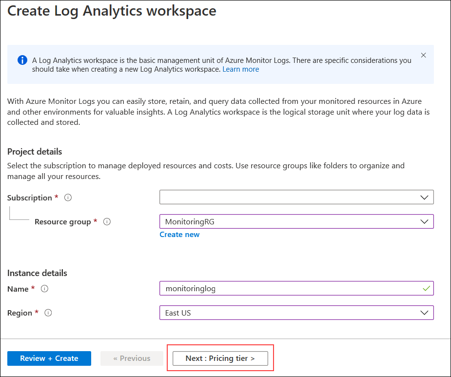
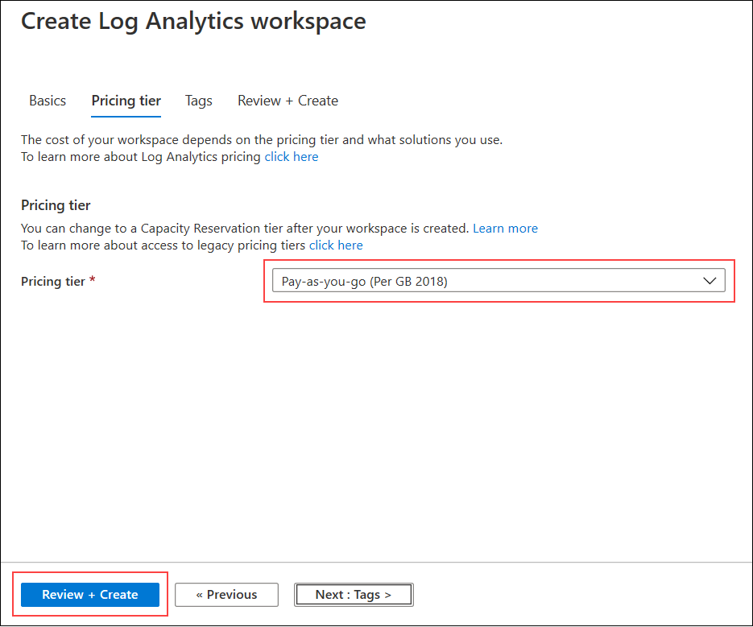
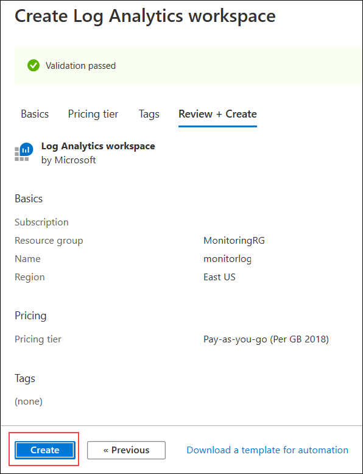

## Exercise 2: Create a Network Monitoring Solution

Duration: 15 minutes

### Task 1: Create a Log Analytics Workspace

1.  From your **LABVM**, connect to the Azure portal, select **+ Create a resource**, and in the list of Marketplace categories, select **IT & Management Tools** followed by selecting **Log Analytics**.

2.  On the **Create workspace** blade, enter the following information:

    -  Name: **Enter Unique Name all lowercase**
    
       >Note: Use **Deployment ID** to make the name unique, get **Deployment ID** from the Environment Details Tab.

    -  Subscription: **Select your Subscription**.

    -  Resource group: Select **MonitoringRG** from the dropdown list of Resource Group.

    -  Location: **East US**
    
    

    And then click on **Next:Pricing tier>** and select **Pay-as-you-go** for the **Pricing tier** and then select **Review + Create** button on the bottom of the page.
   
   

  
3.  Upon completion, it should look like the following screenshot. Validate the information is correct, and select **Create**.

    

### Task 2: Configure Network Watcher

1.  From your **LABVM**, connect to the Azure portal, select **All Services**, and in the Category list, select **Networking** followed by selecting **Network Watcher**.

    

2.  In the **Overview** blade, expand your subscription and select **SouthCentralUS** by selecting the **...** button to the right then enabling the service within the region.

3.   Repeat the step above this time enabling the service within the **East US** region.

   
