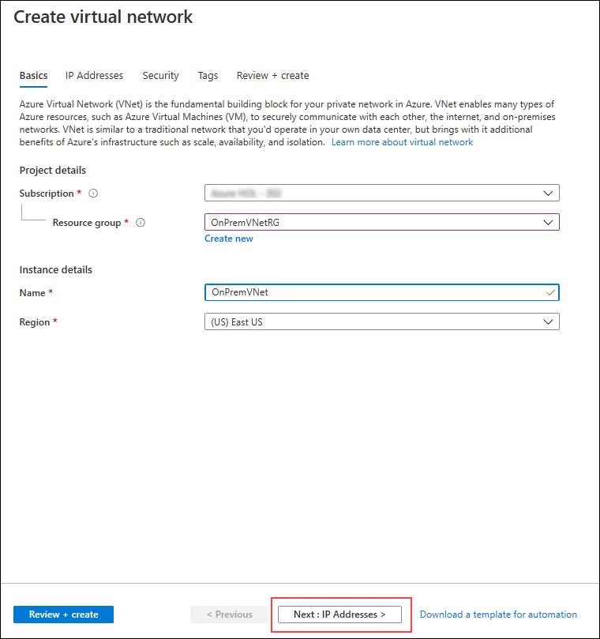
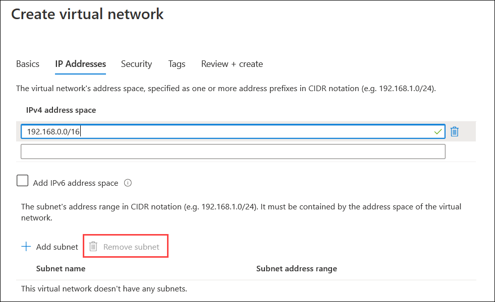
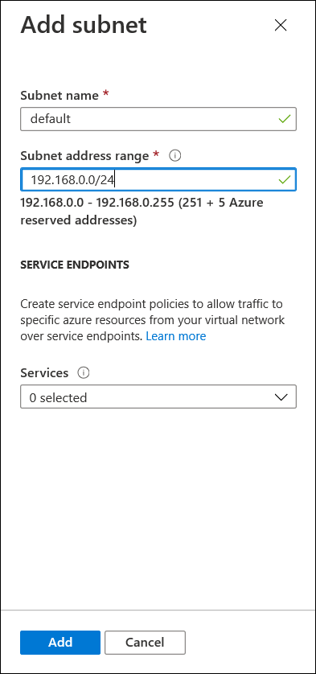
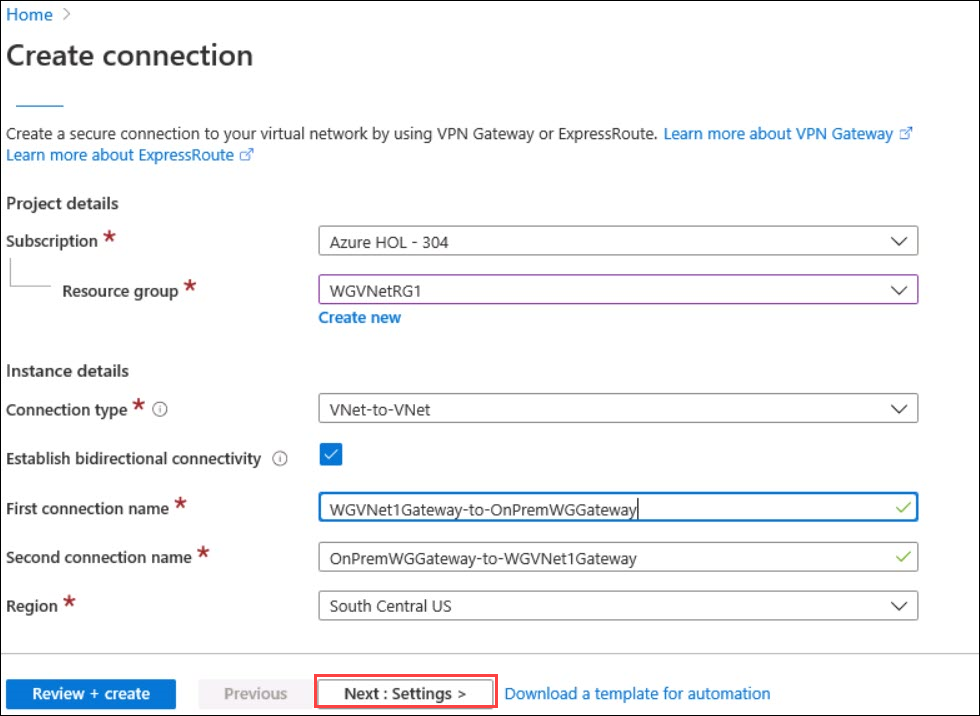
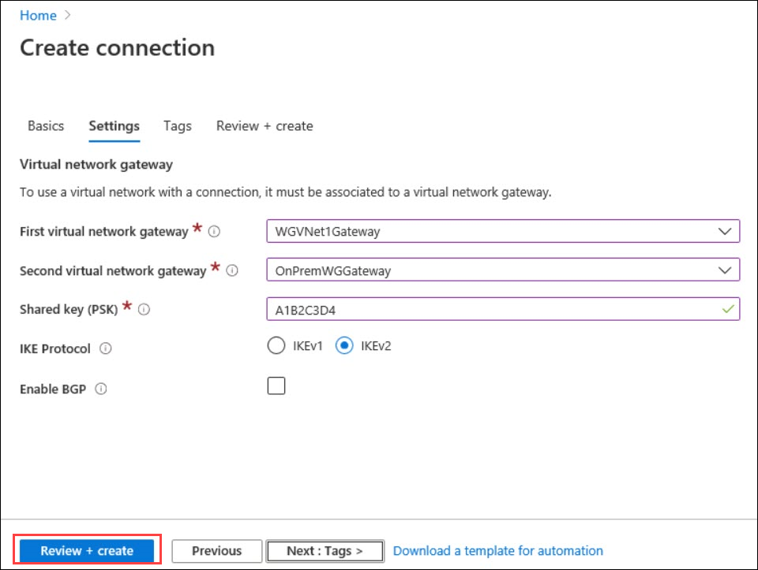

## Exercise 8: Configure Site-to-Site connectivity

Duration: 60 minutes

In this exercise, we will simulate an on-premises connection to the internal web application. To do this, we will first set up another Virtual Network in a separate Azure region followed by the Site-to-Site connection of the 2 Virtual Networks Finally, we will set up a virtual machine in the new Virtual Network to simulate on-premises connectivity to the internal load-balancer.

### Task 1: Create OnPrem Virtual Network

1.  In the Azure portal, select **+ Create a resource**, **Networking** and **Virtual network**.

2.  On the **Create virtual network** blade, enter the following information:

    -  Subscription: **Select your subscription**.

    -  Resource group: Select **OnPremVNetRG** from the drop down list of Resource Group.
    
    -  Name: **OnPremVNet**

    -  Region: **(US) East US** (Make sure this is **NOT** the same location you have specified in the previous exercises.)
    
     
    
3.  And then click on **Next:IP Adressess>** and enter the following information:
    
    -  Address space: **192.168.0.0/16**
    
4.  Then remove the subnet with the name **default** by selecting the subnet and clicking the Remove subnet option right to **+Add subnet** .

     

5. Click on **+ Add subnet** and then following information:
    
    -  Subnet name: **default**

    -  Subnet address range: **192.168.0.0/24**
    
    

6.  Leave the other options with their default values.

7.  Then click on **Review + create** , validate the information is correct, and select **Create**.

### Task 2: Configure gateway subnets for on premise Virtual Network

1.  Select the **OnPremVnetRG** Resource Group and then open the **OnPremVNet** blade and select **Subnets**.

2.  Next, select **+ Gateway subnet**.

    

3.  Specify the following configuration for the subnet, and select **OK**:

    -  Address range: **192.168.1.0/29**

    -  Route table: **None** (We will add later.)

    

4.  Next, select **+ Subnet** and add **OnPremManagementSubnet** to the **OnPremVNet**, as shown below in the screenshot:

    - Name: **OnPremManagementSubnet**
  
    - Address range: **192.168.2.0/29**
  
    - Leave the rest of the values as their defaults. 

    

### Task 3: Create the first gateway

1.  Using the Azure Management portal, select **+ Create a resource**, type **Virtual Network gateway** in the **Search the Marketplace** text box, in the list of results, select **Virtual network gateway**, and then select **Create**.

2.  On the **Create virtual network gateway** blade,  enter the following information and select **Review + create**:

    -  Subscription: **Select your subscription**.

    -  Name: **OnPremWGGateway**

    -  Region: **(US) East US** (This must match the location in which you created the **OnPremVNet** virtual network.)

    -  Gateway type: **VPN**

    -  VPN type: **Route-based**

    -  SKU: **VpnGw1**

    -  Virtual network: **OnPremVNet**

    -  Public IP address: **Create new**

    -  Public IP address name: **onpremgatewayIP1**

    -  Enable active-active mode: **Enabled**

    -  Second Public IP address name: **onpremgatewayIP2**

    -  Configure BGP ASN: **Disabled**

    

3.  Validate your settings and select **Review + Create** then **Create**.

    >**Note:** The gateway will take 30-45 minutes to provision. Rather than waiting, continue to the next task.

### Task 4: Create the second gateway

1.  Using the Azure Management portal, select **+ Create a resource**, type **Virtual Network gateway** in the **Search the Marketplace** text box, in the list of results, select **Virtual network gateway**, and then select **Create**.

2.  On the **Create virtual network gateway** blade,  enter the following information and select **Review + create**:

    -  Subscription: **Select your subscription**.

    -  Name: **WGVNet1Gateway**

    -  Region: **(US) South Central US** (This must match the location in which you created the **WGVNet1** virtual network.)

    -  Gateway type: **VPN**

    -  VPN type: **Route-based**

    -  SKU: **VpnGw1**

    -  Virtual network: **WGVNet1**

    -  Resource group: **WGVNetRG1**

    -  Public IP address: **Create new**

    -  Public IP address name: **vnet1gatewayIP1**

    -  Enable active-active mode: **Enabled**

    -  Second Public IP address name: **vnet1gatewayIP2**

    -  Configure BGP ASN: **Disabled**

    

3.  Validate your settings and select **Create**.

    >**Note:** The gateway will take 30-45 minutes to provision. You will need to wait until both gateways are provisioned before proceeding to the next section.

4.  The Azure portal will display a notification when the deployments have completed.

### Task 5: Connect the gateways

1.  In the Azure portal, select **+ Create a resource**, in the **Search the Marketplace** text box, type in **Connection**, and press **Enter**.

2.  On the **Connection** blade, select **Create**.

3.  On the **Basics** blade provide enter the following information and click on **Next: Settings>**

    -  Subscription: **VNet-to-VNet**
   
    -  Resource group : **WGVNetRG1**
   
    -  Connection type : **VNet-to-VNet**
   
       >Ensure **Establish bidirectional connectivity** is selected.
   
    -  First Connection Name : **WGVNet1Gateway-to-OnPremWGGateway**
   
    -  Second Connection Name : **OnPremWGGateway-to-WGVNet1Gateway**
    
    -  Region : **South Central US**
   
      

4.  On the Settings tab, select **WGVNet1Gateway** as the first virtual network gateway and **OnPremWGGateway** as the second virtual network gateway. Ensure **IKEV2** is selected. Enter a shared key, such as **A1B2C3D4**. Select **Review + create**.

5.  Once the Review is passed validate the information and click on **Create**.

    

6.  In the Azure portal, select **All services**. Then, type **connections** in the search text box and select **Connections**.

    

7.  Watch the progress of the connection status, and use the **Refresh** icon until the status changes for both connections from **Unknown** to **Connected**. This may take 5-10 minutes or more. You might need to refresh the page to see the change in status.

    
